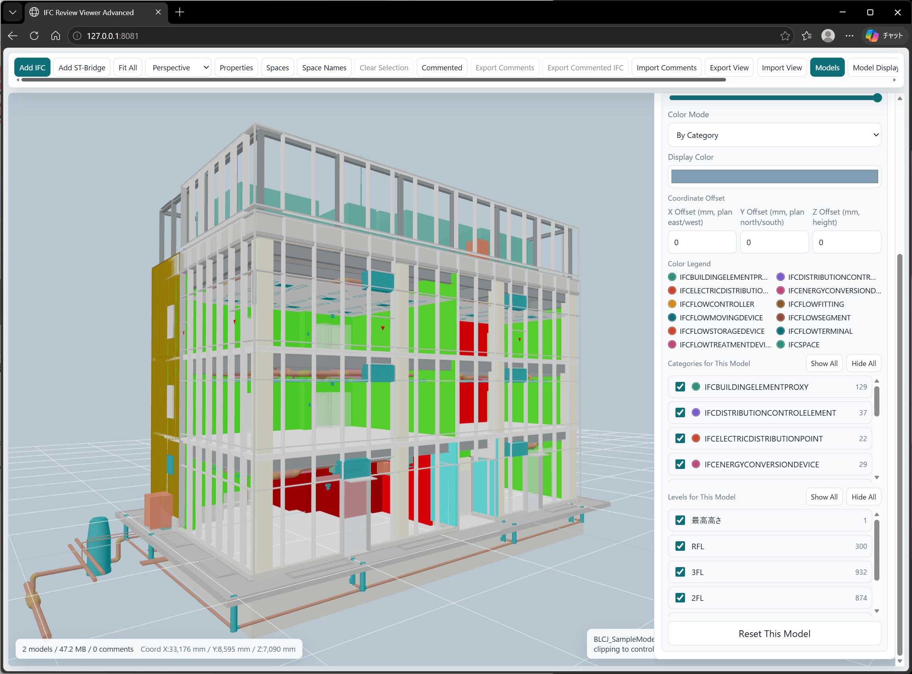
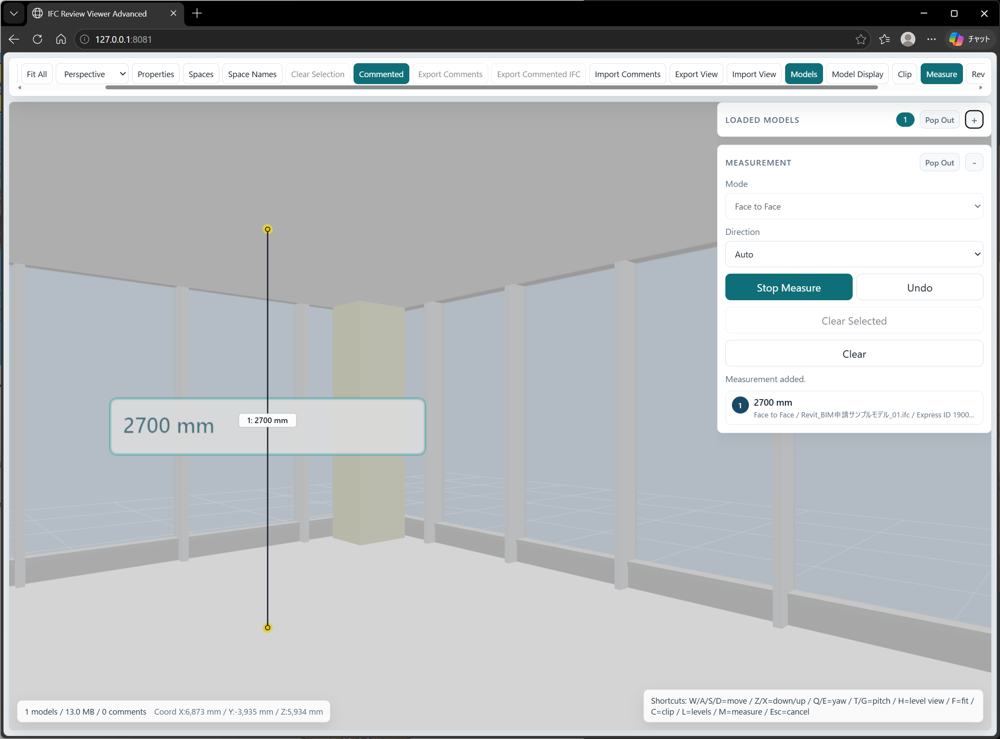

# IFC Review Viewer Advanced

IFC Review Viewer Advanced is an OpenBIM-only version of the browser BIM review viewer.

It is intentionally limited to public, redistributable model formats:

- IFC `.ifc`
- ST-Bridge `.stb`
- ST-Bridge XML `.xml`

This folder does not include converted Revit package data, Revit-derived scene JSON, RVT files, MCP interfaces, A2A gateway UI, server APIs, account systems, or cloud upload workflows.

## Screenshots





## Purpose

This edition removes Revit-dependent data and internal integration features from the internal review viewer, and repackages the result as a public, redistributable IFC / ST-Bridge viewer.

It is intended to provide practical review functions while remaining an OpenBIM-only, vendor-neutral tool:

- Open IFC and ST-Bridge files directly in the browser
- Overlay multiple models
- Adjust visibility, colors, opacity, and coordinate offsets per IFC / ST-Bridge file
- Control visibility by category and level
- Use clipping, attribute-based coloring, space display, room-eye navigation, measurement, comments, and view restoration
- Exchange review comments for elements, whole models, and departments or areas as JSON
- Record review findings and export them as BCFZIP

## What Was Removed

The following internal review-package functions are not part of this OpenBIM edition:

- converted Revit scene data such as `scene.json`, `attributes.json`, and `package-data.js`
- Revit package manifests and link-package manifests
- RVT / RFA / DWG / PDF / Office project files
- internal review return queues and owner write tokens
- MCP, A2A, or specialist-agent gateway interfaces
- Review Hub HTTP server endpoints

## Quick Start

For normal use, no web server is required. Open this file directly in a modern browser:

```text
IFCReviewViewer_Standalone.html
```

The standalone file embeds the viewer bundle and IFC runtime so it can be launched by double-clicking the HTML file.

For development, run the module-based `index.html` page through a local dev server:

```bash
npm install
npm run dev
```

Then open `http://127.0.0.1:8080/`.

`index.html` is intended for development. Because it uses browser ES modules, direct `file://` loading is not reliable across browsers.

For distribution, use the standalone file in:

```text
DISTRIBUTABLE_PACKAGE/IFCReviewViewer_Standalone.html
```

## Model File Locations

Main IFC files:

```text
DISTRIBUTABLE_PACKAGE/IFC/
```

Linked or discipline-specific IFC files:

```text
DISTRIBUTABLE_PACKAGE/IFC/IFC_LINK/
```

ST-Bridge files:

```text
DISTRIBUTABLE_PACKAGE/ST_BRIDGE/
```

Browsers cannot automatically scan these folders from a normal local HTML file. Select each IFC or ST-Bridge file from the viewer UI.

## Build

```bash
npm install
npm run build
```

The build recreates:

- `vendor/ifc-runtime.js`
- `IFCReviewViewer_Standalone.html`

After building, copy the standalone file into `DISTRIBUTABLE_PACKAGE/` before packaging.

## GitHub Publication Checks

Before publishing, run:

```bash
npm ci
npm run check
npm run check:publish
npm audit --audit-level=high
npm run build
```

`npm run check:publish` fails if IFC, ST-Bridge, Revit, DWG, PDF, Office, archive, or XML project data files are present in the repository tree. Release ZIP files are intentionally kept out of Git and should be attached to GitHub Releases instead.

Suggested release assets:

- `IFCReviewViewer_Standalone.html`
- `DISTRIBUTABLE_PACKAGE_OpenBIM_Advanced_v0.2.0.zip`

## License

This project is MIT licensed. Bundled third-party runtime components remain under their respective licenses, especially `web-ifc` under MPL-2.0. See `THIRD_PARTY_NOTICES.md`.
